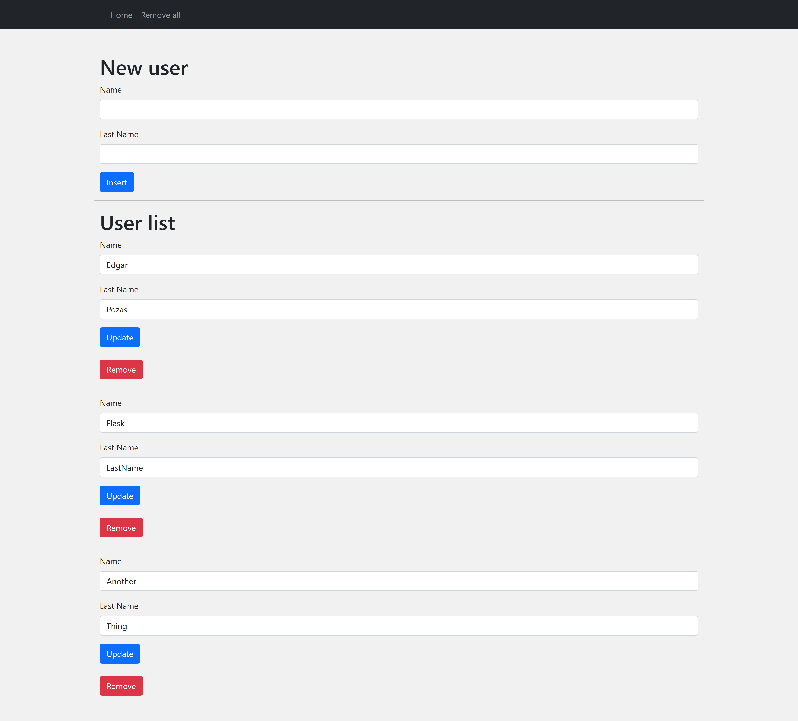

# FlaskBasic

This is a simple example using Flask

## Requirements

You need the following programs:
* Python (>=3.9.0)
* Flask (>=1.1.2)

## Installation

First download or clone the repository. Next to place inside the folder.

## Run

In order to start the server, first make sure that you have the virtual environment created if not run the next command

```bash
#for windows
py -3 -m venv venv
#for linux
python3 -m venv venv
```

Next run the activate command which is placed inside the folder vent/Scripts

```bash
#for windows
.\venv\Scripts\activate.bat
#for linux
.\venv\Scripts\activate
```

Once the virtual environment is activated set the variable of the entry point
```bash
#for windows
set FLASK_APP=app.py
#for linux
export FLASK_APP=app.py
```

Finally run the next command to start the server
```bash
flask run
```

## Views
Main

